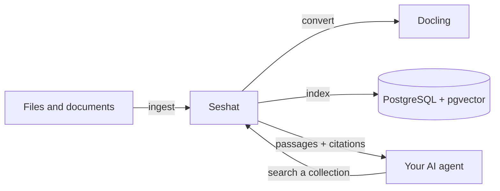

# Seshat

Seshat is the document and retrieval engine for your AI agents. Give it files
or application data, then ask it for grounded passages and citations your agent
can use to answer with confidence.



## Capabilities

- Ingest application data, crawler output, exports, and custom integrations as text.
- Upload PDF, Word, PowerPoint, Excel, HTML, text, and Markdown files.
- Search isolated collections with hybrid or vector retrieval.
- Return passages with caller-owned source identity, page citations, and
  scan-ready section references when available.
- Inspect recognized source structure and traverse every canonical block in order.
- Keep originals available to authenticated applications and viewers.

## Get Running

Seshat's default Docker Compose stack includes PostgreSQL with pgvector and
Docling, so PDF and Office support are ready from the first start.

```bash
git clone https://github.com/thehapyone/Seshat.git
cd Seshat
cp seshat.example.toml seshat.toml
cp .env.example .env
# Set your embedding endpoint and model in seshat.toml, and the API token,
# cursor-signing key, and provider key in .env. Every setting is listed in
# docs/configuration.md.
docker compose up -d --build
```

Seshat reads its settings from `seshat.toml` and its secrets from the
environment. See the [Configuration Reference](docs/configuration.md).

When the stack is healthy, Seshat is available at `http://127.0.0.1:8080`.
Explore the interactive API at `http://127.0.0.1:8080/docs`.

## Give Your Agent Knowledge

First, set the API token from `.env`:

```bash
export SESHAT_TOKEN='the SESHAT_API_TOKEN value from .env'
```

Send an application-owned record:

```bash
curl -sS -X POST http://127.0.0.1:8080/v1/documents/text \
  -H "Authorization: Bearer $SESHAT_TOKEN" \
  -H 'Content-Type: application/json' \
  -d '{
    "collection_id": "support",
    "external_id": "returns-policy",
    "title": "Returns policy",
    "source_uri": "https://example.com/returns",
    "text": "Customers can return unused items within 30 days."
  }'
```

Or upload a document:

```bash
curl -sS -X POST http://127.0.0.1:8080/v1/documents/file \
  -H "Authorization: Bearer $SESHAT_TOKEN" \
  -F collection_id=support \
  -F external_id=returns-policy \
  -F file=@./returns-policy.pdf
```

Both calls return a `job_id`. Poll `GET /v1/jobs/{job_id}` until it completes,
then let your agent retrieve relevant context:

```bash
curl -sS -X POST http://127.0.0.1:8080/v1/search \
  -H "Authorization: Bearer $SESHAT_TOKEN" \
  -H 'Content-Type: application/json' \
  -d '{
    "collection_ids": ["support"],
    "query": "How long do customers have to return an item?"
  }'
```

## Bring Your Own Sources

Seshat accepts two inputs: normalized text and uploaded files. That makes it
easy to connect the systems your agent already uses.

| Your source                                                        | Send to Seshat                                                                                    |
| ------------------------------------------------------------------ | ------------------------------------------------------------------------------------------------- |
| Database records, SaaS exports, web crawlers, or custom connectors | `POST /v1/documents/text`                                                                         |
| Local and application-uploaded documents                           | `POST /v1/documents/file`                                                                         |
| PDF, Word, PowerPoint, Excel, and HTML                             | File upload; Docling converts them by default, or Azure AI Document Intelligence when configured. |

Seshat does not bundle direct connectors for S3, Google Drive, Notion, GitHub,
or websites. Keep source-specific authentication and sync logic with the owning
application, then send the resulting text or files to Seshat.

## Next Steps

- See the interactive API reference at `/docs` on your running Seshat instance.
- Read the [API Reference](docs/api.md) for supported endpoints and requests.
- Use the [Seshat knowledge skill](.agents/skills/seshat-knowledge/SKILL.md) when
  teaching an AI agent how to choose and compose those capabilities.
- Read [Architecture](docs/architecture.md) for deployment, configuration, and
  lifecycle details.
- Read [Contributing](CONTRIBUTING.md) for local development.

Seshat is released under the [MIT License](LICENSE).
